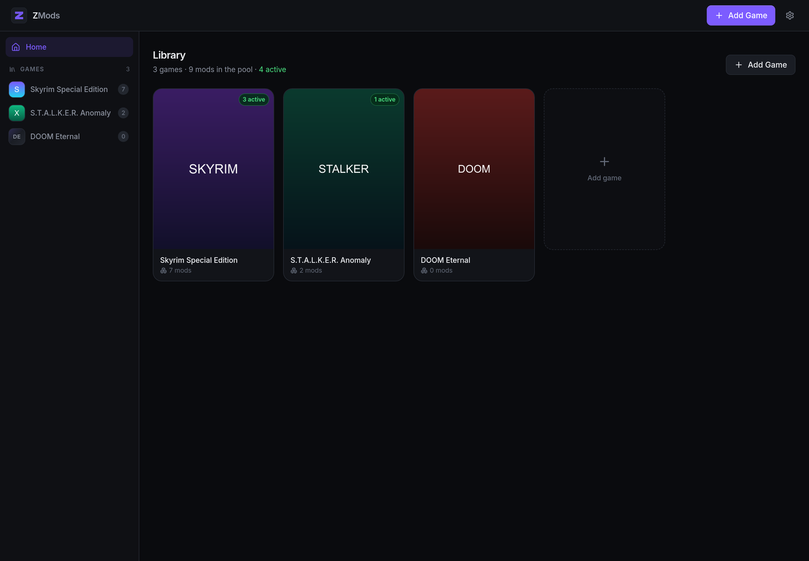
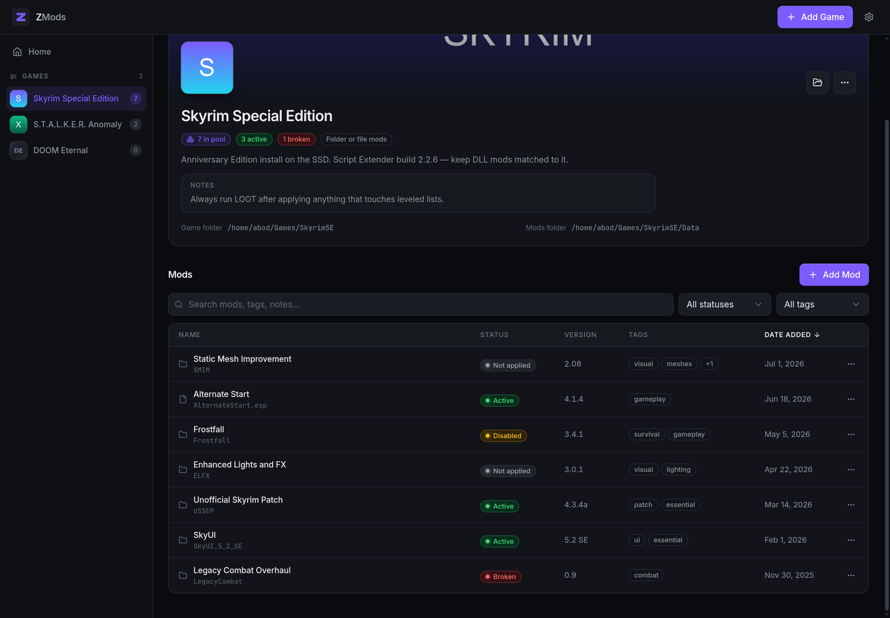
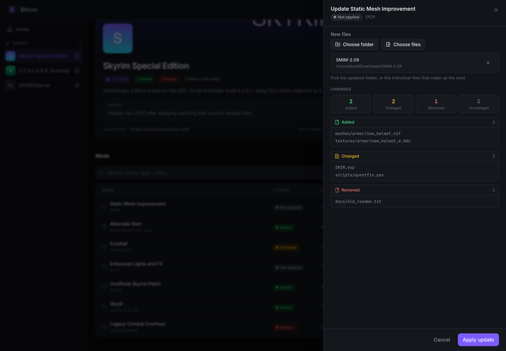
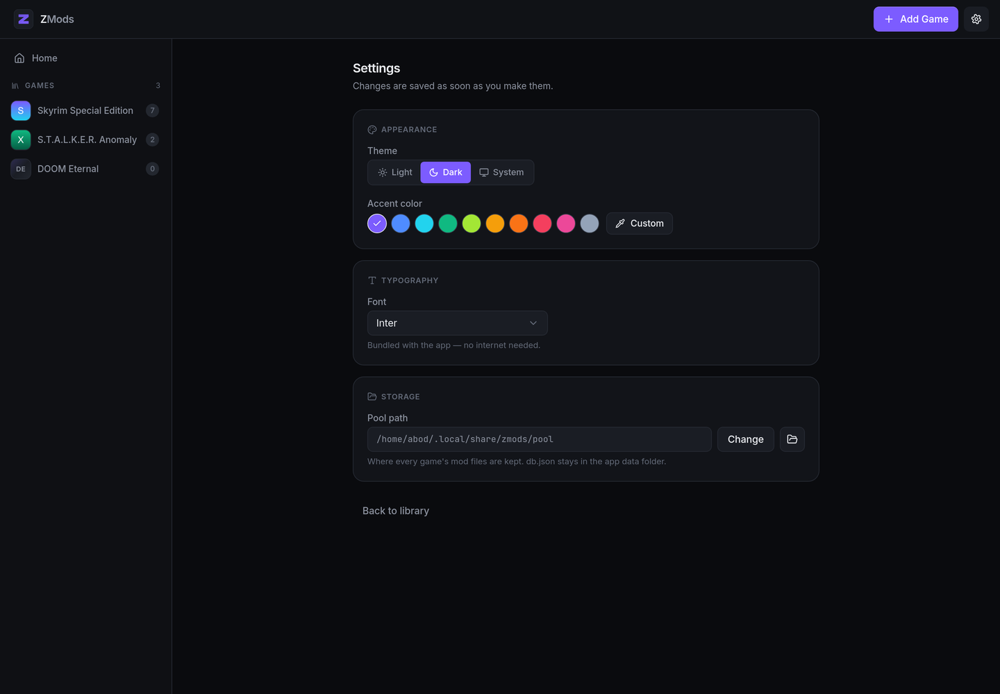

<!--
  Before publishing: replace every abodesalm below with your GitHub username,
  and publish a release (see "Building from source") so the download links resolve.
-->

<div align="center">


# ZMods

**A desktop mod manager that keeps your game folder clean.**

Store every mod in one pool, then apply, disable, update or remove it with a
click — without ever digging through the game directory by hand.


</div>



---

## What it does

Mod managers usually fail in the same place: once files are copied into the game
folder, nobody knows what came from where. ZMods records **every file it writes**,
so removing a mod removes exactly those files and nothing else.

- **One pool per game.** Mods live in ZMods' own storage. The game folder only
  ever holds what you have actually applied.
- **Apply, disable, remove — reversibly.** Disabling parks a mod without deleting
  it. Removing from the game leaves it in the pool for later.
- **Update with a diff.** Point ZMods at a new version and it shows you exactly
  which files are added, changed and removed before you commit.
- **Honest state.** Every launch re-checks the disk. If files vanished, the mod
  is flagged `broken` instead of silently lying to you.
- **Folder mods and file mods.** Per game, or per mod for games that use both.
- **Search, filter and tag** your pool; sort by name, status, version or date.
- **Yours to look at.** Dark and light themes, any accent colour, six bundled
  fonts. No telemetry, no account, no network calls.

---

## Install

Grab the file for your system from the
**[latest release](https://github.com/abodesalm/zmods/releases/latest)**.

<details open>
<summary><b>Windows</b></summary>

<br>

Download **`ZMods_0.1.0_x64-setup.exe`** and run it. (An `.msi` is also provided
if you prefer it for deployment.)

Windows 11 and up-to-date Windows 10 already have everything needed. On older
Windows 10 the installer will offer to fetch
[WebView2](https://developer.microsoft.com/microsoft-edge/webview2/) — let it.

> **"Windows protected your PC"**
>
> The builds are not code-signed (certificates cost money), so SmartScreen warns
> about them. Click **More info → Run anyway**. If that makes you uneasy, build
> it yourself — see [Building from source](#building-from-source).

</details>

<details open>
<summary><b>macOS</b></summary>

<br>

Download the `.dmg` for your Mac and drag ZMods to Applications:

| Mac                   | File                      |
| --------------------- | ------------------------- |
| Apple Silicon (M1–M4) | `ZMods_0.1.0_aarch64.dmg` |
| Intel                 | `ZMods_0.1.0_x64.dmg`     |

> **"ZMods is damaged and can't be opened"**
>
> It isn't — macOS says this about any app that isn't notarised. Clear the
> quarantine flag once, then open it normally:
>
> ```bash
> xattr -dr com.apple.quarantine /Applications/ZMods.app
> ```

</details>

<details open>
<summary><b>Linux</b></summary>

<br>

**AppImage — works on any distro**

```bash
chmod +x ZMods_0.1.0_amd64.AppImage
./ZMods_0.1.0_amd64.AppImage
```

Self-contained, nothing to install. Needs FUSE 2 (`libfuse2` on Debian/Ubuntu,
`fuse2` on Arch) — most systems already have it.

**Debian, Ubuntu, Mint** — needs Ubuntu 22.04+ or Debian 12+ for WebKitGTK 4.1

```bash
sudo apt install ./ZMods_0.1.0_amd64.deb
```

**Fedora, RHEL, openSUSE**

```bash
sudo dnf install ./ZMods-0.1.0-1.x86_64.rpm
```

**Arch, Manjaro, EndeavourOS**

From the AUR, with any helper:

```bash
yay -S zmods-bin      # prebuilt, installs in seconds
yay -S zmods          # builds from source, ~3 min
```

Or build the package yourself and let pacman track it:

```bash
git clone https://github.com/abodesalm/zmods.git
cd zmods/packaging && makepkg -si
```

Either way, `sudo pacman -Rns zmods` uninstalls cleanly. See
[packaging/README.md](packaging/README.md) for details.

</details>

---

## Getting started

**1. Add a game.** Click **+ Add Game** and fill in two paths:

- **Game folder** — where the game is installed.
- **Mods folder** — where applied mods should be copied. For Skyrim that is
  `.../Skyrim Special Edition/Data`; for most games it is a `mods/` directory.

Then pick whether this game's mods are folders, single files, or both. Cover art,
an icon and a hero banner are optional but make the library much nicer to look at.

**2. Add mods to the pool.** On the game page, **+ Add Mod** copies files into
ZMods' storage. The game folder is not touched yet.

**3. Apply what you want.** Use the **⋯** menu on any row:

| Action               | What happens                                                         |
| -------------------- | -------------------------------------------------------------------- |
| **Apply**            | Copies the mod from the pool into the game's mods folder             |
| **Remove from game** | Deletes exactly the files it copied; the mod stays in the pool       |
| **Disable**          | Pulls it from the game and parks it in the pool's `disabled/` folder |
| **Enable**           | Puts it back and re-applies it                                       |
| **Update**           | Pick a new version, review the diff, then commit                     |
| **Remove from pool** | Deletes it everywhere                                                |



### Updating a mod

Choose **Update**, point at the new download, and ZMods compares it against
what is in the pool — file by file, by content, not just by name. Nothing is
written until you press **Apply update**. If the mod was applied, it is
re-deployed to the game folder automatically.



### Making it yours



Theme, accent colour, font and pool location all live in Settings and save the
moment you change them.

---

## Where your data lives

|         | Path                                   |
| ------- | -------------------------------------- |
| Linux   | `~/.local/share/zmods/`                |
| macOS   | `~/Library/Application Support/zmods/` |
| Windows | `%APPDATA%\zmods\`                     |

`db.json` holds your library — games, mods, tags, notes, settings. It is plain
JSON, so it is easy to back up or inspect. Mod files sit in `pool/`, which you
can relocate to another drive from **Settings → Pool path** (ZMods moves the
existing files for you).

Uninstalling ZMods never deletes this folder. Remove it by hand if you want a
clean slate.

---

## Troubleshooting

**"Mods folder not found"** — the game moved, or an external drive is not
mounted. Fix the path with **⋯ → Edit game**; ZMods will carry applied mods
across to the new location.

**A mod shows as `broken`** — its files are missing from the pool (deleted, or
the pool moved without them). Use **⋯ → Update** and point at the files again to
repair it.

**Nothing happens when I apply a mod** — check the toast in the bottom-right
corner. Errors stay on screen until dismissed and carry the exact reason.

**Linux: it runs from the terminal but my app launcher says "executable not
found"** — your desktop session's `PATH` does not include `~/.local/bin`, because
graphical sessions do not read `~/.bashrc` or `~/.zshrc`. The installer writes an
absolute path so this should not happen; if you launch it some other way, add:

```bash
mkdir -p ~/.config/environment.d
echo 'PATH=$HOME/.local/bin:$PATH' > ~/.config/environment.d/10-local-bin.conf
```

then log out and back in.

---

## Building from source

You need [Rust](https://rustup.rs) and Node 20+, plus:

- **Windows** — [MSVC Build Tools](https://visualstudio.microsoft.com/visual-cpp-build-tools/)
  with the "Desktop development with C++" workload
- **macOS** — `xcode-select --install`
- **Linux** — WebKitGTK **4.1** and friends:
  `webkit2gtk-4.1 gtk3 librsvg base-devel` (Arch) or
  `libwebkit2gtk-4.1-dev libgtk-3-dev librsvg2-dev patchelf` (Debian/Ubuntu)

```bash
npm install
npm run app              # dev build with hot reload
npm run app:build        # release build (use app:build:linux on Linux)
```

Bundles land in `src-tauri/target/release/bundle/`.

> On Linux use `app:build:linux`. It sets `NO_STRIP=1`, without which the
> AppImage step fails — linuxdeploy bundles an old binutils whose `strip` cannot
> parse the `.relr.dyn` sections modern toolchains emit.

**Tauri cannot cross-compile** — each platform's installer needs that platform's
native tooling. To build for all three from one machine, push a tag and let CI do
it; `.github/workflows/release.yml` builds Linux, Windows and both macOS
architectures, then attaches everything to a draft release:

```bash
git tag v0.1.0 && git push --tags
```

---

## Contributing

Issues and pull requests are welcome. See
[docs/ARCHITECTURE.md](docs/ARCHITECTURE.md) for how the codebase is laid out and
which invariants matter.

## License

Not chosen yet — add a `LICENSE` file before sharing this publicly.
[choosealicense.com](https://choosealicense.com) is a good place to start.
